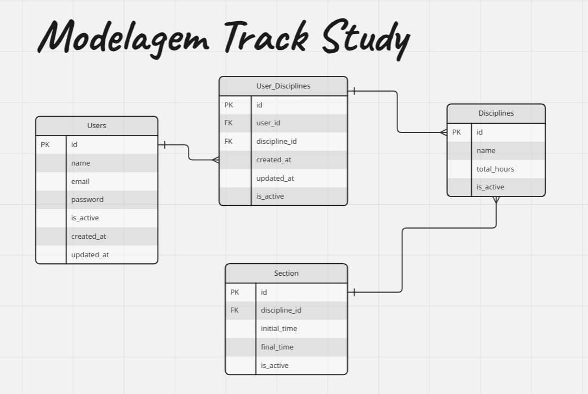

# Track Study - Catalogador de estudos

Sistema que registre tempos/ciclos de estudos.

Com o objetivo dos estudantes mensurarem o tempo de estudos de acordo com cada disciplina.

## Diagrama Entidade-Relacionamento

## Funcionalidades:
- #1 | Cadastrar disciplina
- #2 | Atualizar disciplina
- #3 | Deletar disciplina
- #4 | Configurar cronômetro de estudo
- #5 | Iniciar cronômetro de estudo 
- #6 | Finalizar cronômetro de estudo
- #7 | Cadastrar período de estudo
- #8 | Somar a quantidade de hora de estudo
